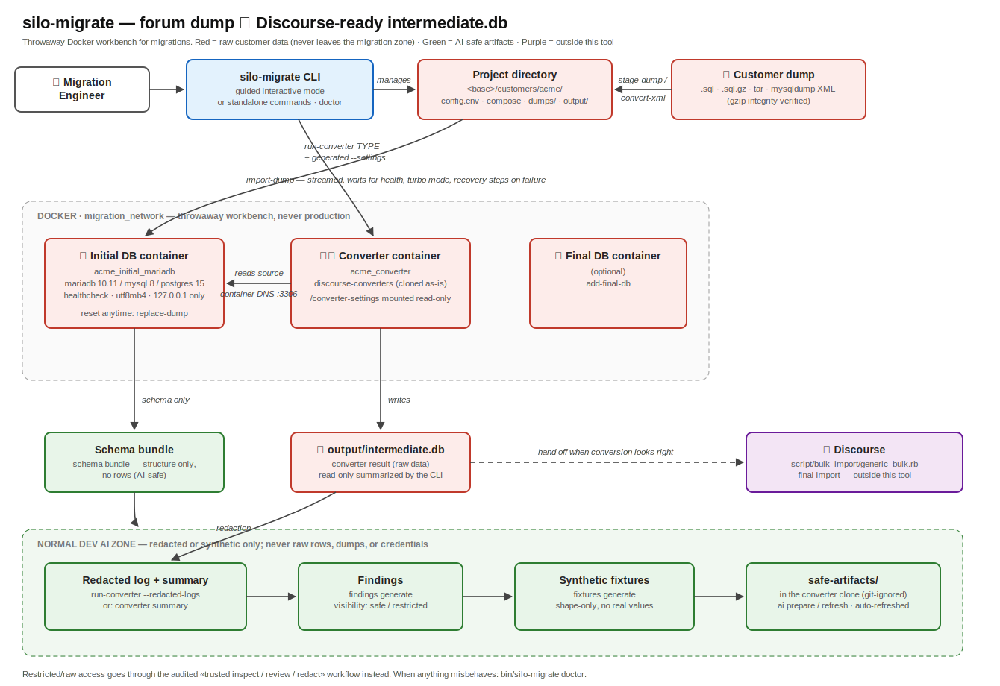
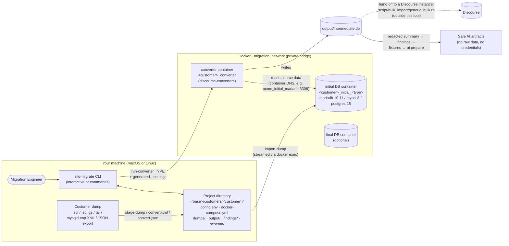
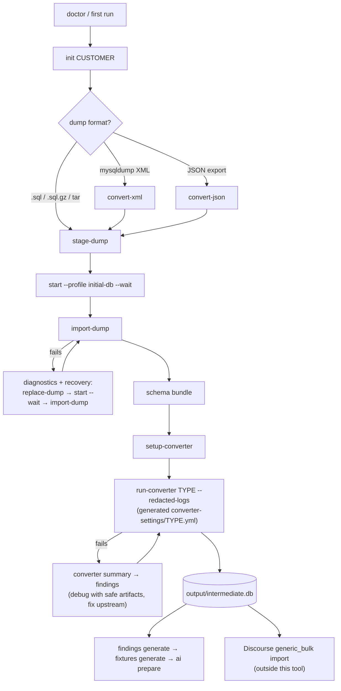
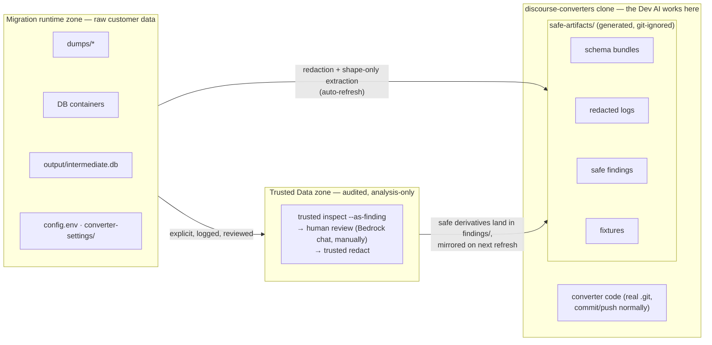

# silo-migrate — Migration Engineer's Guide

A practical overview of what the tool does, what it deliberately does not do, and
the two ways to drive it (guided interactive mode and standalone commands).
For internals and design rationale, see [`ARCHITECTURE.md`](../ARCHITECTURE.md).

> **One-page visual:** [`migration-overview.svg`](migration-overview.svg) shows the
> whole system at a glance (open it in a browser; it renders on GitHub too).



## What this tool is

`silo-migrate` turns a customer's raw forum database dump into a Discourse-ready
intermediate database, using **throwaway Docker containers** as the workbench.
You point it at a dump; it provisions a source database container, restores the
dump into it, runs the matching `discourse-converters` converter against that
database over a private Docker network, and collects the converter's output
(`output/intermediate.db`) plus AI-safe artifacts (schema bundles, redacted
logs, findings, synthetic fixtures).

Nothing it creates is production infrastructure. Every container exists only to
host data long enough for conversion and can be destroyed and rebuilt from the
dump at any time.

## How everything is connected



Key wiring facts:

- **Containers talk over `migration_network`** using container names as DNS
  hostnames (`acme_initial_mariadb:3306`). Your host reaches the same databases
  on `127.0.0.1:<mapped port>` (see each phase's `dumps/<phase>/CONNECTION.md`).
- **`run-converter CUSTOMER TYPE` generates `converter-settings/TYPE.yml`**
  automatically — the platform's default settings with the real container
  hostname, internal port, and credentials merged in — and passes it via
  `--settings`. Without this, converter defaults point at `localhost` and cannot
  reach the database from inside the container.
- **Everything is rebuildable**: `replace-dump` wipes a database volume so you
  can re-import; `cleanup` removes the whole project (it refuses to delete the
  directory if containers could not be stopped, unless you pass `--force`).

## What the tool CAN do

| Area | Capabilities |
|------|--------------|
| Environment | `doctor` preflight (Ruby, gems, Docker daemon, Compose v2, git, base path, free disk); first-run prompt picks and persists where projects live |
| Projects | `init` / `list` / `status` / `regenerate` / `cleanup`; per-customer `config.env` compatible with the legacy Python toolkit layout |
| Dumps | Stage `.sql`, `.sql.gz`, tar archives containing SQL; mysqldump **XML → SQL** conversion (`convert-xml`, streaming, batched INSERTs); generic **JSON → SQL** conversion (`convert-json`, streaming relational shredding, optional `--schema-dir` JSON Schemas for exact types + PII tracking, `--recover-truncated` for cut-off files); `analyze-dump` (tables, sizes, source engine); `preprocess-dump` (MySQL generated-column fixes); gzip integrity verification before import |
| Databases | MariaDB 10.11, MySQL 8.0, PostgreSQL 15 containers with healthchecks, utf8mb4 defaults, and import-friendly InnoDB settings; optional separate **final** database |
| Import | Streamed restore (constant memory, progress + ETA), waits for container health, MySQL-8-collation auto-fix on MariaDB, table exclusion, `--fast`/`--turbo` modes, per-error diagnostics with exact recovery commands |
| Converter | Clones/builds `discourse-converters` in its own container; platform shortcut (`run-converter acme vbulletin`) with auto-generated in-network settings, or any custom command after `--` |
| Artifacts | Schema bundles (`schema bundle`), redacted converter logs/summaries, structured findings, shape-only synthetic fixtures, `safe-artifacts/` in the converter clone (`ai prepare`, auto-refreshed by the generators) |
| Data safety | Raw dumps, live DBs, `intermediate.db`, and generated credentials never reach AI workspaces or logs; restricted data goes through the audited `trusted ...` workflow |

## What the tool CANNOT do (by design)

- **It does not import into Discourse.** The pipeline ends at
  `output/intermediate.db`. The final step — running Discourse's
  `script/bulk_import/generic_bulk.rb` against that file — happens in a
  Discourse instance, outside this tool.
- **It does not host production databases.** Containers bind to `127.0.0.1`,
  use root credentials from `config.env`, and trade durability for import speed
  (`innodb-doublewrite=0` etc.). Treat them as scratch space.
- **It does not provision SQL Server.** Platforms whose converters connect to
  SQL Server (e.g. `forza`, `higher_logic`) are detected and rejected with
  guidance — bring your own database and pass `--settings` manually.
- **It does not modify `discourse-converters`.** The converter repo is cloned
  and orchestrated as-is; converter bugs are fixed upstream, aided by the
  findings/fixtures artifacts this tool produces.
- **No incremental imports.** A dump is restored whole; to retry you reset the
  database (`replace-dump`) and import again.
- **Docker is the only active runtime.** The Silo/Incus runtime is a Phase-4
  placeholder behind the same contract; Podman is best-effort, untested.
- **Real customer data never becomes a fixture.** Fixtures are shape-only and
  synthetic; anything containing raw values stays in the migration runtime zone
  or behind the `trusted` workflow.

## Happy path — interactive mode

Run `bin/silo-migrate` (or `bin/silo-migrate acme`). The guided mode computes a
**recommended next step** from project state each time you return to the menu,
so the happy path is mostly "press enter on the recommendation":

1. **First run only** — prompted for a base path (default `~/migrations/customers`),
   persisted to `~/.config/silo-migrate/config.env`. Warned early if Docker is down.
2. **Select or create the project** — pick from existing projects or name a new
   one; choose the initial DB type (mariadb/mysql/postgres) and port.
3. **Add the initial dump** — choose SQL dump, tar archive, XML dumps, or JSON
   export files (XML/JSON are converted to `.sql.gz` on the spot, with
   file-exclusion and batch-size prompts; JSON also auto-detects a `schema/`
   directory of `*.schema.json` files for exact column types and PII tracking,
   and offers record-level recovery when a file is truncated).
   Path input has tab completion; `back`/`b`/`..` returns to the menu.
4. **Start initial DB and import** — confirms the target, starts the container,
   waits for health, offers large-table exclusions and turbo mode (recommended
   for >1 GB), streams the import with progress, and writes an
   `.imported.json` marker. A schema bundle is generated automatically after.
5. **Add final database** (optional) — same flow for the target-side DB.
6. **Set up converter** — clones `discourse-converters` (with SSH passphrase
   retry if needed), builds the container, runs `bundle install`.
7. **Run converter command** — runs the converter; on completion you are offered
   the chain: redacted summary → findings → synthetic fixtures, each defaulting
   to yes.
8. **Advanced actions** menu covers everything else: status, start/stop by
   profile, convert XML, convert JSON, schema bundle, converter summary,
   replace dump, regenerate compose, cleanup.

## Happy path — CLI command mode

The same flow as explicit, repeatable commands (what you'd put in a runbook):

```bash
# 0. one-time machine setup
bin/silo-migrate doctor

# 1. create the project (mariadb is the usual source engine)
bin/silo-migrate init acme --db-type mariadb

# 2. stage the customer dump (sql, sql.gz, or tar containing sql)
bin/silo-migrate stage-dump acme initial /path/to/forum-dump.sql.gz
#    ...or convert mysqldump XML straight into the project:
bin/silo-migrate convert-xml /path/to/xml-dir -c acme --compress
#    ...or convert JSON export files (schemas optional; see help convert-json):
bin/silo-migrate convert-json /path/to/json-dir -c acme --schema-dir /path/to/schemas

# 3. start the source DB and restore the dump into it
bin/silo-migrate start acme --profile initial-db --wait
bin/silo-migrate import-dump acme initial --turbo

# 4. capture the AI-safe schema bundle
bin/silo-migrate schema bundle acme

# 5. set up and run the converter (settings are generated automatically)
bin/silo-migrate setup-converter acme --bundle-install
bin/silo-migrate run-converter acme vbulletin --redacted-logs

# 6. derive the safe artifacts for converter development
bin/silo-migrate findings generate acme
bin/silo-migrate fixtures generate acme
bin/silo-migrate ai prepare acme

# 7. hand off: output/intermediate.db goes to a Discourse instance's
#    script/bulk_import/generic_bulk.rb (outside this tool)

# done? park or remove the workbench
bin/silo-migrate stop acme
bin/silo-migrate cleanup acme --yes
```

Useful variations:

```bash
bin/silo-migrate help import-dump                      # every flag, per command
bin/silo-migrate analyze-dump dump.sql.gz              # what's in this dump?
bin/silo-migrate run-converter acme -- ./convert --from vbulletin --settings /converter-settings/vbulletin.yml
bin/silo-migrate replace-dump acme initial --yes       # reset DB, then re-import
bin/silo-migrate converter summary acme                # re-summarize without re-running
```

## The pipeline at a glance (states and recovery)



## Data-safety zones (what AI tooling may see)

Converter **code** is not customer data — it lives in exactly one place, the
project's `discourse-converters` git clone, where the Dev AI edits, commits,
and pushes normally. Only **data artifacts** are zone-separated: `ai prepare`
writes a locally git-ignored `safe-artifacts/` directory *inside* the clone,
and redacted-log/findings/fixture generation refreshes it automatically.



Rule of thumb: anything under `dumps/`, `output/`, `trusted/`,
`converter-settings/`, `config.env`, or inside a container is raw-zone — the
generated `AGENTS.md` and `.claude/settings.json` deny rules keep agents away
from those `../` paths (a soft boundary on macOS; Silo mounts make it hard
later). Everything under `safe-artifacts/` has been redacted or synthesized.

## Quick troubleshooting

| Symptom | Do this |
|---------|---------|
| Anything feels broken | `bin/silo-migrate doctor` |
| Import failed mid-way | Read the diagnostics block — it names the error and prints the exact `replace-dump` / `start --wait` / `import-dump` recovery commands |
| "gzip integrity check failed" | The dump is truncated — re-transfer it (don't bypass unless you're certain) |
| "Malformed JSON in FILE … appears to be truncated" | The JSON export was cut off. Re-export it for the full data; meanwhile `--recover-truncated` (or the guided-mode prompt) keeps the complete records and reports recovered counts, or skip the file with `-X FILE` |
| JSON tables/columns look unexpected | Conventions: nested objects flatten (`avatar.url` → `avatar_url`); arrays become `<table>_<path>` child tables joined via `_parent_id` (natural key) or `_parent_sid`; deep/mixed shapes land in `*_json` TEXT columns. See "JSON-to-SQL Conversion Design" in the workspace ARCHITECTURE.md |
| Converter can't reach the DB | Use the platform shortcut so settings are generated; if compose was regenerated, recreate the container: `start CUSTOMER --profile converter` |
| Port already in use | Interactive mode offers a free port; or `init`/`add-final-db` with an explicit `--port` |
| Huge dump is slow on a Mac | Expected (Docker Desktop fsync); the preflight warns. Prefer a Linux host for multi-GB imports |
| Want a clean slate | `replace-dump CUSTOMER PHASE --yes` (one DB) or `cleanup CUSTOMER --yes` (everything — **push converter work first**, the clone lives inside the project dir) |
| `safe-artifacts/` shows in `git status` | Re-run `ai refresh CUSTOMER` (it rewrites the `.git/info/exclude` block) |
| `git pull` conflicts with `AGENTS.md` | Upstream added its own — delete the generated file, pull, re-run `ai refresh` (it falls back to `safe-artifacts/AGENTS.md`) |
